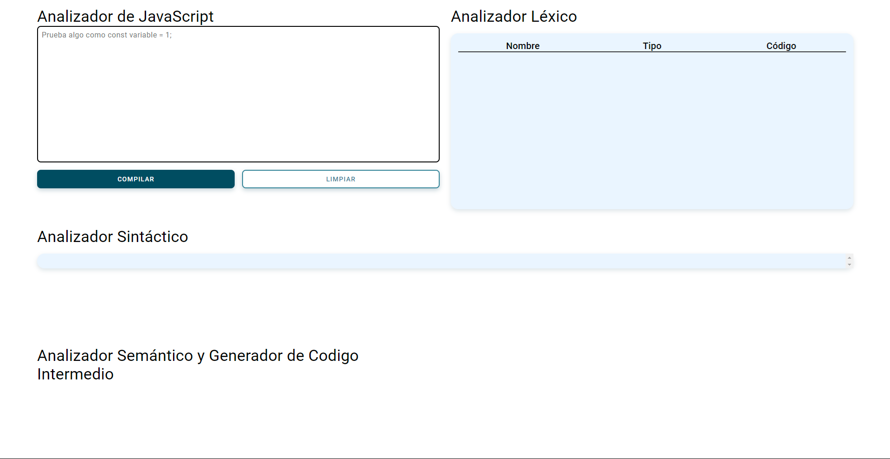

# Analizador de JavaScript

Este proyecto consiste en un analizador de JavaScript desarrollado con HTML, CSS y JavaScript puro. Permite a los usuarios ingresar código JavaScript, realizar análisis léxico, sintáctico y semántico, y mostrar los resultados en una interfaz web interactiva.

## Características
- **Análisis Léxico:** Identifica y clasifica lexemas como identificadores y números.
- **Análisis Sintáctico:** Verifica la estructura gramatical del código, incluyendo declaraciones de variables y estructuras condicionales simples.
- **Análisis Semántico:** Realiza análisis de contexto para variables declaradas y asignaciones, determinando tipos y generando código intermedio.
- **Generación de Código Intermedio:** Genera código intermedio para estructuras condicionales simples y declaraciones de variables.

## Capturas de Pantalla



## Uso

1. **Clonar el repositorio:**
   ```bash
   git clone https://github.com/tu-usuario/Analizador-JS.git
2. **Abrir index.html en un navegador web moderno.**

3. **Ingresar código JavaScript en el área de texto y presionar "Compilar".**

## Tecnologías Utilizadas

1. **HTML5**
2. **CSS3**
3. **JavaScript (ES6+)**
4. **SCSS**

# Estructura del Proyecto
```bash
├── index.html
├── style.css
├── style.scss
├── style.css.map
├── app.js
├── lexemas.json
└── README.md
```

## Autores
1. **Andres Briend**
2. **Joaquin Suarez**